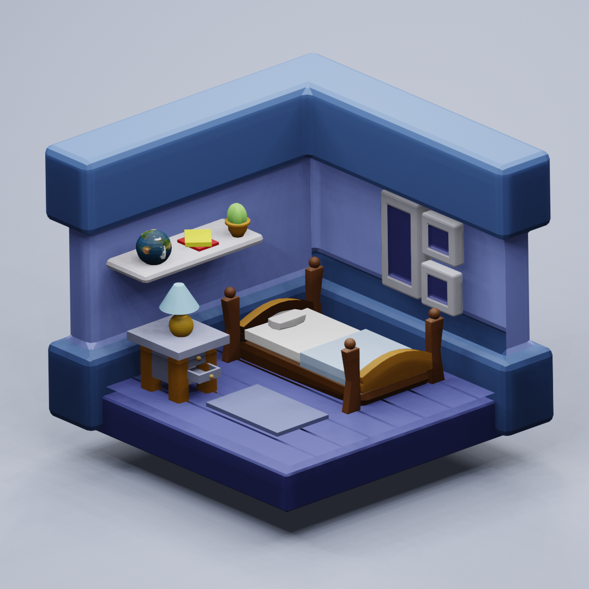

# Multiverse Madness

This is a <b>Fully Responsive Frontend Web App</b> with different animations using <a href="https://nextjs.org/">Next JS </a>, it also contains a small <a href="https://www.blender.org/">Blender</a> project inside the multiverse worlds

## Deployment

You can deploy it on your local machine using:-

```bash
$ npm run dev
```

To create a build version:-

```bash
$ npm run build
```

To obtain a build version in a `.next` file

## Showcase

The website is live and can be viewed at:-
<br /><br />
[](https://app.netlify.com/sites/multiverse-madness/deploys)
<br />
https://multiverse-madness.netlify.app/

## Preview

<a href="https://multiverse-madness.netlify.app/" target="_blank"></a>

## Blender Project

<a href="./img_readme/untitled.blend" download>
</a>
